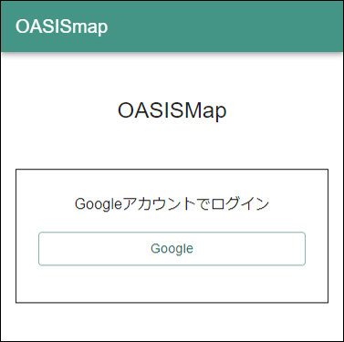
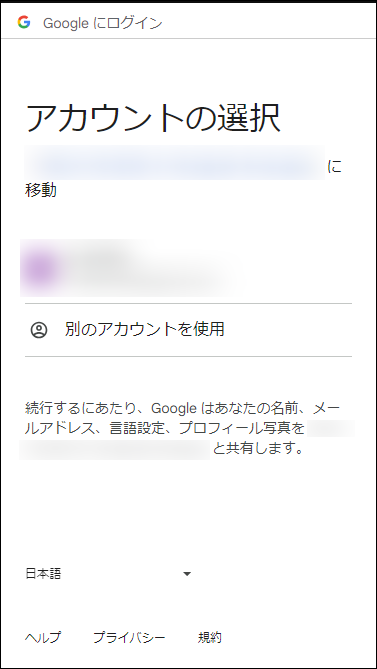
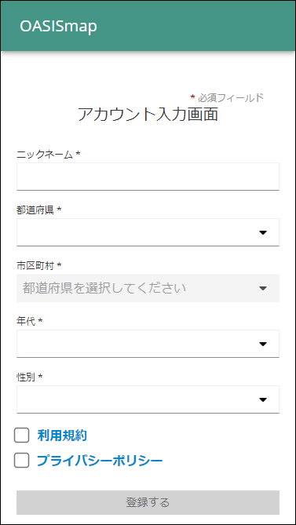
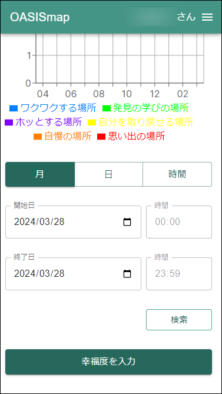
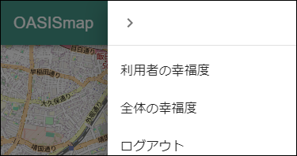

# oasismap - ウェルビーイングを実現するための、地域の協調的幸福度の可視化プラットフォーム


## 目次

- [OASIS Map - ウェルビーイングを実現するための、地域の協調的幸福度の可視化プラットフォーム](#OASIS-Map---ウェルビーイングを実現するための、地域の協調的幸福度の可視化プラットフォーム)
  - [目次](#目次)
  - [本プロジェクトについて](#本プロジェクトについて)
  - [oasismapの始め方 クイックスタート](#oasismapの始め方-クイックスタート)
    - [概要](#概要)
    - [インストール方法](#インストール方法)
    - [基本的な使い方](#基本的な使い方)
      - [管理者向け](#管理者向け)
      - [利用者向け](#利用者向け)
      - [アプリケーション停止方法](#アプリケーション停止方法)
  - [利用バージョン](#利用バージョン)

## 本プロジェクトについて

基盤ソフトウェア「[FIWARE](https://www.fiware.org/)」([ファイウェア](https://www.fiware.org/))を用いて、地域の協調的幸福度を可視化するプラットフォーム

## oasismapの始め方 クイックスタート
 
### 概要

- `docker compose`で提供しております。
- `docker compose 2.21.0`, `docker 24.0.7` をインストール済みの `Ubuntu 22.04.3` 上で動作確認しております。
- またインストールの中で `curl` を使用しております。


### インストール方法

1. git clone 

  ```
  git clone git@github.com:c-3lab/oasismap.git
  ```

2. 作業ディレクトリに移動

  ```
  cd oasismap
  ```

3. MongoDBとPostgreSQLのユーザー、パスワードおよび地図の初期パラメータ値(緯度、経度、ズーム値)、KeyCloakの設定を.envに設定

  ```
  ~/oasismap$ cp _env .env
  ~/oasismap$ vi .env
  ```

  ※`GENERAL_USER_KEYCLOAK_CLIENT_SECRET` , `ADMIN_KEYCLOAK_CLIENT_SECRET` は後ほど設定

4. Dockerコンテナを展開

  ```
  ~/oasismap$ docker compose up -d
  ```

### Google Cloud 事前準備
1. [Google Cloud](https://console.cloud.google.com/apis/credentials)に接続

2. `プロジェクトを選択` から新しいプロジェクトを作成

3. `認証情報を作成` を選択して `OAuth クライアント ID` を作成

4. アプリケーションの種類に `ウェブアプリケーション` を選択して作成

5. クライアントID、シークレットを `keycloak/variables.json` の `GoogleClientID` `GoogleClientSecret` に転記


Keycloakの手順も抜粋して入れ込みたいです。

### Keycloak 自動設定
1. keycloakディレクトリに移動

  ```
  cd keycloak
  ```

2. `formatting-variables.sh` を実行して都道府県名/市区町村名の情報を `variables.json` に設定

```
~/keycloak$ bash formatting-variables.sh
```

3. 自動設定スクリプトで利用する環境変数を設定

```
~/keycloak$ KEYCLOAK_ADMIN={.envで指定した管理者ユーザー名}
~/keycloak$ KEYCLOAK_ADMIN_PASSWORD={.envで指定した管理者ユーザーのパスワード}
```

4. keycloakディレクトリのパスを取得

```
~/keycloak$ pwd
```

5. 以下のコマンドを実行
※4で取得したkeycloakディレクトリのパスに書き換えて実行すること

```
~/keycloak$ docker run --network oasismap_backend-network --volume {keycloakディレクトリのパス}:/etc/newman/keycloak \
 postman/newman:latest run --bail --environment /etc/newman/keycloak/variables.json \
 --env-var "KeycloakAdminUser=$KEYCLOAK_ADMIN" \
 --env-var "KeycloakAdminPassword=$KEYCLOAK_ADMIN_PASSWORD" \
 /etc/newman/keycloak/postman-collection.json
```


### 環境変数の準備と追加

#### Keycloak
1. ブラウザから `http://Dockerホスト名:8080`でアクセスします。

2. 「Administration Console」をクリック

3. 環境変数 `KEYCLOAK_ADMIN` `KEYCLOAK_ADMIN_PASSWORD` に指定した認証情報でログイン

4. Google CloudにリダイレクトURIを設定
    1. `realm` から `oasismap` を選択
    2. 左のメニューバーから `Identity providers` を選択
    3. `google` をクリック
    4. `Redirect URI` の値をコピーして控えておく
    5. [Google Cloud](https://console.cloud.google.com/apis/credentials)に接続
    6. 事前準備にて作成した認証情報を選択
    7. `承認済みのリダイレクトURI` に控えておいた `Redirect URI` を転記

5. 環境変数 `GENERAL_USER_KEYCLOAK_CLIENT_SECRET`の設定
    1. `realm` から `oasismap` を選択
    2. 左のメニューバーから `client` をクリック
    3. `general-user-client` をクリック
    4. `Credentials` をクリック
    5. `Client Secret` の値を `GENERAL_USER_KEYCLOAK_CLIENT_SECRET` に転記

6. 環境変数 `ADMIN_KEYCLOAK_CLIENT_SECRET`の設定
    1. `realm` に `oasismap` を選択
    2. 左のメニューバーから `client` をクリック
    3. `admin-client` をクリック
    4. `Credentials` をクリック
    5. `Client Secret` の値を `ADMIN_KEYCLOAK_CLIENT_SECRET` に転記

7. コンテナを再起動して環境変数を反映させる
  ```
  ~/oasismap$ docker compose up -d frontend
  ```

### orionにサブスクリプション設定を行う

以下コマンドを実行してorionにサブスクリプションの設定を行う
```
~/oasismap$ curl -iX POST \
  --url 'http://localhost:1026/v2/subscriptions' \
  --header 'content-type: application/json' \
  --header 'Fiware-Service: Government' \
  --header 'Fiware-ServicePath: /Happiness' \
  --data '{
  "description": "Notice of entities change",
  "subject": {
    "entities": [
      {
        "idPattern": ".*",
        "type": "happiness"
      }
    ],
    "condition": {
      "attrs": []
    }
  },
  "notification": {
    "http": {
      "url": "http://cygnus:5055/notify"
    }
  }
}'
```

### 基本的な使い方

#### 管理者向け

1. 管理者アカウントの準備
  1. `realm` から `oasismap` を選択
  2. 左のメニューバーから `Users` を選択
  3. `Add User` を選択
  4. `Username`,`profile.attribute.nickname` を入力して `Create` を選択
  - ※ `Username` と `profile.attribute.nickname` は同じ値を入れてください
  5. `Credentials` を選択して `Set password` からパスワードを入力してください
  6. パスワード入力後, `Temporary` のチェックを外して `Save`
  7. `Save password` から保存

2. ブラウザから `http://Dockerホスト名:3000/admin/login` でアクセスします

3. 管理者用アカウントでログインします

4. データエクスポート

#### 利用者向け

1. ブラウザから `http://Dockerホスト名:3000` でアクセスします

    

2. googleアカウントを用いてログイン
  
    

3. ユーザー情報の入力
  ※重複するニックネームは登録できません
  
    

4. 幸福度の入力
  
    1. 画面下の `幸福度の入力` をクリックします
  
        

    2. 任意の項目にチェックを入れて `幸福度を送信` をクリックします
  
        

5. 利用者幸福度の表示
  
    1. 右端のハンバーガーメニューをクリックします
  
        

    2. 一覧から `利用者の幸福度` をクリックします
  
        

    3. `利用者の幸福度` が地図上とグラフに表示されます
  
        

6. 全体幸福度の表示
  
    1. 右端のハンバーガーメニューをクリックします
  
        

    2. 一覧から `全体の幸福度` をクリックします
  
        

    3. `全体の幸福度` が地図上とグラフに表示されます
  
        

#### アプリケーション停止方法

- コンテナを停止
  ```
  ~/oasismap$ docker compose down
  ```


## 利用バージョン

- [next 14.1.0](https://nextjs.org/)
- [nest 10.0.0](https://nestjs.com/)
- [react 18系](https://ja.reactjs.org/)
- [typescript 5系](https://www.typescriptlang.org/)
- [eslint 8系](https://eslint.org/)
- [prettier 3系](https://prettier.io/)
- [jest 29.5.0](https://jestjs.io/ja/)
- [Postgresql 16.1](https://www.postgresql.org/)
- [FIWARE Cygnus 3.5.0](https://fiware-cygnus.readthedocs.io/en/master/index.html)
- [FIWARE Orion 3.11.0](https://fiware-orion.readthedocs.io/en/master/index.html)
- [mongoDB 6.0.14](https://www.mongodb.com/)
- [node 20.10.0](https://nodejs.org/ja/about/releases/)

## ライセンス

- [AGPL-3.0](LICENSE)